<div align="center">



</div>

<br>

---

```
// about
```

I want to understand the *why* in everything related to development and building not just the *how*. 


<br>

---

<div align="center">



</div>

<br>

---

<div align="center">



</div>

<br>

---

<div align="center">



</div>

<br>

---

<div align="center">



</div>

<br>

---

<div align="center">


</div>
